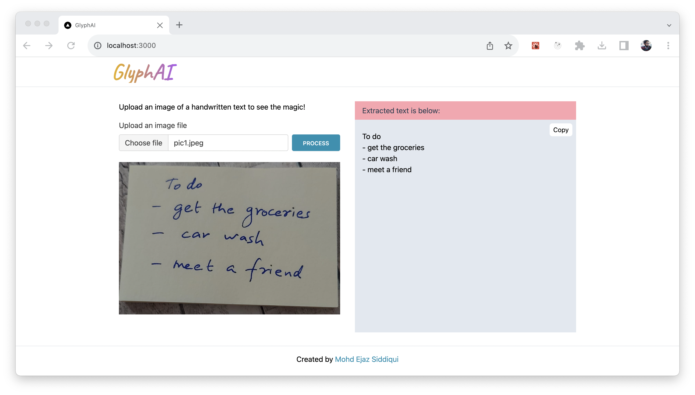

# GlyphAI

  

A project to recognise handwritten text from an image and convert it into digital text. 

## Pre-requisites to run this project

1. AWS KEYS

## Steps to run this project

1. Clone the repo
2. Run `npm install` to install all the dependencies
3. Create a `.env.local` from `env-example` file: `cp env-example .env.local`
4. Update the AWS  keys in the `.env.local` file
5. Run `npm run dev` to start the project

## Tech Stack

- NextJS
- TailwindCSS
- AWS Textract

## Contact

mohdejazsiddiqui@gmail.com